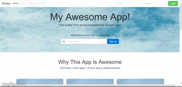

# bootstrap projects

I have created some bootstrap projects, have a look  :point_down: :point_down: :point_right: 

 

 

### Table of Contents

| No. | Questions |
| --- | --------- |
|   | **Core React** |
|1  | [What is React?](#what-is-react) |

1. react => Entire front-end design of this app is made by Reactjs.

2. The API I have used is "disease.sh".

3. material-UI => I've used Material-UI to style this application.

4. react-chartjs => to build the chart graphical representation.

5. numeral => for tooltip, when we hover on the graph, we can get the value on that point.

6. react-leaflet => to build the map.

7. firebase => to deploy the app

1. react => Entire front-end design of this app is made by Reactjs.

2. The API I have used is "disease.sh".

3. material-UI => I've used Material-UI to style this application.

4. react-chartjs => to build the chart graphical representation.

5. numeral => for tooltip, when we hover on the graph, we can get the value on that point.

6. react-leaflet => to build the map.

7. firebase => to deploy the app

1. react => Entire front-end design of this app is made by Reactjs.

2. The API I have used is "disease.sh".

3. material-UI => I've used Material-UI to style this application.

4. react-chartjs => to build the chart graphical representation.

5. numeral => for tooltip, when we hover on the graph, we can get the value on that point.

6. react-leaflet => to build the map.

7. firebase => to deploy the app

1. react => Entire front-end design of this app is made by Reactjs.

2. The API I have used is "disease.sh".

3. material-UI => I've used Material-UI to style this application.

4. react-chartjs => to build the chart graphical representation.

5. numeral => for tooltip, when we hover on the graph, we can get the value on that point.

6. react-leaflet => to build the map.

7. firebase => to deploy the app

1. react => Entire front-end design of this app is made by Reactjs.

2. The API I have used is "disease.sh".

3. material-UI => I've used Material-UI to style this application.

4. react-chartjs => to build the chart graphical representation.

5. numeral => for tooltip, when we hover on the graph, we can get the value on that point.

6. react-leaflet => to build the map.

7. firebase => to deploy the app

1. react => Entire front-end design of this app is made by Reactjs.

2. The API I have used is "disease.sh".

3. material-UI => I've used Material-UI to style this application.

4. react-chartjs => to build the chart graphical representation.

5. numeral => for tooltip, when we hover on the graph, we can get the value on that point.

6. react-leaflet => to build the map.

7. firebase => to deploy the app

1. ### What is React?

    React is an **open-source frontend JavaScript library** which is used for building user interfaces especially for single page applications. It is used for handling view layer for web and mobile apps. React was created by [Jordan Walke](https://github.com/jordwalke), a software engineer working for Facebook. React was first deployed on Facebook's News Feed in 2011 and on Instagram in 2012.

   **[⬆ Back to Top](#table-of-contents)**
